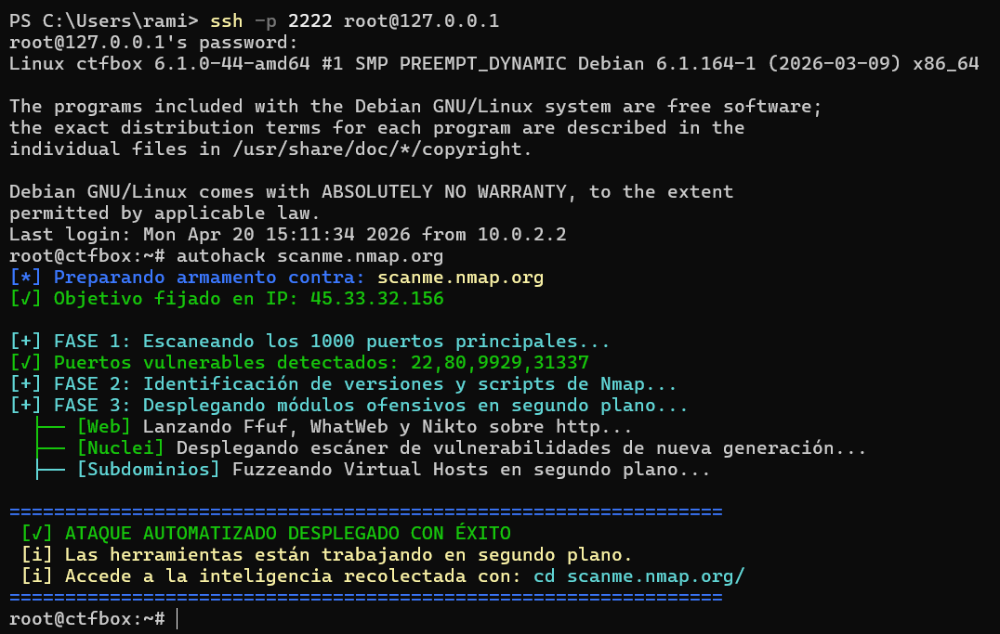

# 🛡️ PwnBox: Laboratorio CTF y Entorno Red Team Automatizado

<p align="center">
  
</p>
Este proyecto utiliza **Packer** e **Infraestructura como Código (IaC)** para desplegar una máquina virtual Debian 12 ofensiva, configurada con cero toques (*Zero-Touch Provisioning*) y lista para asaltar plataformas como HackTheBox, TryHackMe o entornos de auditoría reales.

---

## 🚀 Características Principales

* **Instalación Desatendida & Cross-Platform:** Configuración automática mediante `preseed.cfg`. Incluye vacunas automáticas de caracteres (`sed CRLF a LF`) para garantizar que el código clonado en Windows funcione perfectamente al compilarse en Linux.
* **Conectividad CTF de Fábrica:** Cliente `openvpn` preinstalado para conexión directa a redes privadas de hacking.
* **Entorno Visual:** Terminal Zsh con Starship prompt, ofuscación de logs de instalación y banners ASCII profesionales.
* **Sandbox de Pruebas:** Motor `docker.io` integrado para desplegar víctimas locales (ej. OWASP Juice Shop) en segundos sin salir de la máquina.

---

## ⚔️ El Arsenal Ofensivo

La máquina viene precompilada con binarios de nueva generación y repositorios estándar de la industria:

* **Escáneres Modernos:** Nuclei v3 (Binario directo con plantillas pre-descargadas).
* **CMS & Web:** WPScan (entorno Ruby configurado), WhatWeb, Nikto.
* **Fuzzing & Red:** Ffuf, Nmap, Enum4linux, SMBClient.
* **Diccionarios & Escalada:** SecLists completos y script de LinPEAS listo para ejecutarse.

---

## 🧠 Herramientas Customizadas (Scripts)

### 1. `autohack`: El Misil Inteligente v3.0
Un script de automatización modular diseñado para evadir firewalls y ejecutar cadenas de ataque lógicas:
* **Bypass de Firewalls/NAT:** Escaneo TCP Connect (`-sT`) optimizado para evitar bloqueos por WAF o cuellos de botella en redes locales.
* **Detección de Protocolos:** Lógica HTTP/HTTPS dinámica basada en el análisis de puertos en tiempo real.
* **Ejecución Condicional:**
  * Lanza **WPScan** solo si detecta la huella `wp-content` en el código fuente.
  * Dispara **Nuclei** en modo silencioso sobre cualquier puerto web.
  * Activa **Fuzzing de Subdominios** solo si el objetivo es un nombre de dominio (Virtual Host Routing).
* **Uso:** `autohack <IP o Dominio>`

### 2. Soporte Táctico
* **`revshell`:** Generador instantáneo de payloads para shells inversas en múltiples lenguajes.
* **`ctf-recon`:** Escáner rápido de puertos abiertos.

---

## 🏗️ Cómo Construir tu Base de Operaciones

**Requisitos previos:** Instalar [Packer](https://www.packer.io/) y VirtualBox en tu sistema anfitrión.

**1. Compilación de la imagen:**
Ejecuta el siguiente comando en la raíz del proyecto (la terminal de tu anfitrión):

```bash
packer build -force packer/debian.pkr.hcl

(El proceso descargará dependencias, compilará herramientas como Go/Ruby y generará la máquina en la carpeta output-ctf-box).

2. Despliegue y Túnel SSH:

Importa el archivo .ovf resultante en VirtualBox.

Configura una regla de Reenvío de Puertos en VirtualBox (Red -> Avanzadas):

Puerto Anfitrión: 2222 | Puerto Invitado: 22

Arranca la máquina.

3. Infiltración:
Conéctate remotamente desde tu terminal principal usando la huella segura:

Bash
ssh-keygen -R "[127.0.0.1]:2222"
ssh -p 2222 root@127.0.0.1
🎯 Guía Rápida de Combate
Ataque automatizado a dominio:

Bash
autohack scanme.nmap.org
Conexión a HackTheBox / TryHackMe:
Sube tu archivo de configuración y ejecuta:

Bash
openvpn mi_conexion.ovpn
Desplegar campo de tiro local (OWASP Juice Shop):

Bash
docker run --rm -p 80:3000 bkimminich/juice-shop
# En otra terminal: autohack localhost